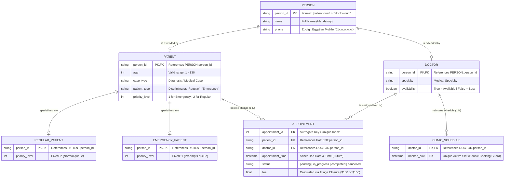
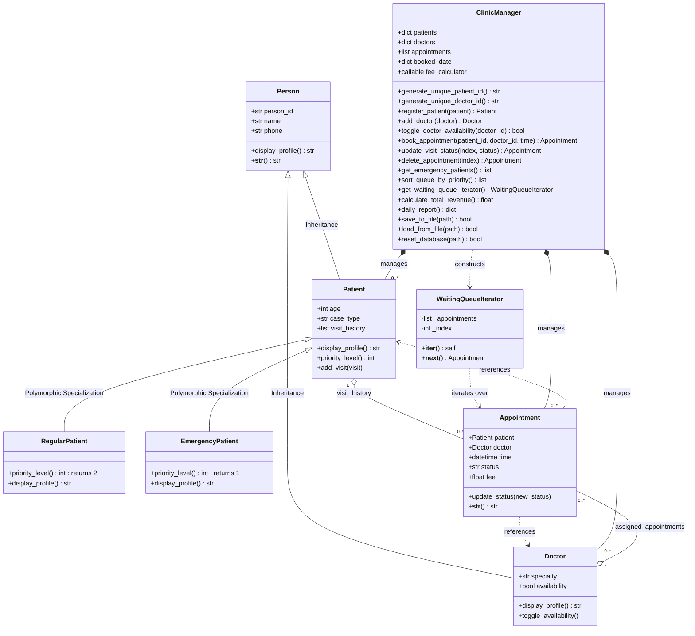

# Smart Clinic Queue System - ERD & Class Diagrams
**Samsung Innovation Campus (SIC) - Capstone Project**

---

## 1. Full Logical Entity Relationship Diagram (ERD)

مخطط العلاقات الكيانية المنطقي (Crow's Foot Notation) يوضح الكيانات الأساسية، الحقول، المفاتيح الأساسية والخارجية (PK/FK)، والعلاقات بين الجداول:



---

## 2. Object-Oriented Class Diagram (OOP Design & Polymorphism)

مخطط الأصناف الموجهة للكائنات (Class Diagram) يوضح الوراثة، البوليمورفيزم، العلاقات، والـ Orchestrator (`ClinicManager`):



---

## 3. Relational Schema in 3rd Normal Form (3NF)

الهيكل العلائقي المكافئ لقواعد البيانات العلائقية (RDBMS) في الصيغة المعيارية الثالثة (3NF):

```sql
-- 1. جدول المرضى (يرث خواص Person)
CREATE TABLE Patients (
    person_id      VARCHAR(20) PRIMARY KEY, -- regex: ^patient-[0-9]+$
    name           VARCHAR(100) NOT NULL,
    phone          CHAR(11) NOT NULL,       -- regex: ^01[0-9]{9}$
    age            INT CHECK (age BETWEEN 1 AND 130),
    case_type      VARCHAR(200) NOT NULL,
    patient_type   VARCHAR(10) CHECK (patient_type IN ('Regular', 'Emergency')),
    priority_level INT CHECK (priority_level IN (1, 2))
);

-- 2. جدول الأطباء (يرث خواص Person)
CREATE TABLE Doctors (
    person_id      VARCHAR(20) PRIMARY KEY, -- regex: ^doctor-[0-9]+$
    name           VARCHAR(100) NOT NULL,
    phone          CHAR(11) NOT NULL,       -- regex: ^01[0-9]{9}$
    specialty      VARCHAR(100) NOT NULL,
    availability   BOOLEAN DEFAULT TRUE
);

-- 3. جدول المواعيد الطبية (Associative Entity يفك علاقة Many-to-Many)
CREATE TABLE Appointments (
    appointment_id   INT AUTO_INCREMENT PRIMARY KEY,
    patient_id       VARCHAR(20) NOT NULL,
    doctor_id        VARCHAR(20) NOT NULL,
    appointment_time DATETIME NOT NULL,
    status           VARCHAR(15) DEFAULT 'pending' CHECK (status IN ('pending', 'in_progress', 'completed', 'cancelled')),
    fee              DECIMAL(6,2) NOT NULL,
    FOREIGN KEY (patient_id) REFERENCES Patients(person_id) ON DELETE CASCADE,
    FOREIGN KEY (doctor_id) REFERENCES Doctors(person_id) ON DELETE CASCADE
);

-- 4. جدول حماية المواعيد ومنع التكرار (Double Booking Guard)
CREATE TABLE Doctor_Booked_Slots (
    doctor_id   VARCHAR(20) NOT NULL,
    booked_time DATETIME NOT NULL,
    PRIMARY KEY (doctor_id, booked_time),
    FOREIGN KEY (doctor_id) REFERENCES Doctors(person_id) ON DELETE CASCADE
);
```

---

## 4. Comprehensive Data Dictionary (قاموس البيانات التفصيلي)

| Entity / Table | Field Name | Data Type | Key / Constraint | Validation / Business Rule | Description |
| :--- | :--- | :--- | :--- | :--- | :--- |
| **Person** | `person_id` | `VARCHAR(20)` | **PK** | Regex: `^(patient\|doctor)-[0-9]+$` | المعرف الفريد للشخص في النظام |
| | `name` | `VARCHAR(100)` | NOT NULL | Non-empty string | الاسم الكامل للشخص |
| | `phone` | `CHAR(11)` | NOT NULL | Regex: `^01[0-9]{9}$` | رقم الهاتف المحمول المصري المكون من 11 رقماً |
| **Patient** | `age` | `INT` | NOT NULL | 1 <= age <= 130 | عمر المريض بالسنوات |
| | `case_type` | `VARCHAR(200)` | DEFAULT `'General Checkup'` | Text | وصف الحالة المرضية / التشخيص |
| | `patient_type` | `VARCHAR(10)` | ENUM | `'Regular'` أو `'Emergency'` | نوع المريض لتحديد المسار العلاجي |
| | `priority_level`| `INT` | COMPUTED | `1` (Emergency) أو `2` (Regular) | مستوى الأولوية المستخدم في ترتيب طابور الانتظار |
| **Doctor** | `specialty` | `VARCHAR(100)` | NOT NULL | Text | التخصص الطبي للطبيب |
| | `availability`| `BOOLEAN` | DEFAULT `TRUE` | `True` (Available) / `False` (Busy) | حالة توفر الطبيب لاستقبال كشوفات جديدة |
| **Appointment** | `appointment_id`| `INT` | **PK** | Surrogate / Array Index | المعرف التسلسلي للموعد |
| | `patient_id` | `VARCHAR(20)` | **FK** | Must exist in `Patients` | معرّف المريض صاحب الحجز |
| | `doctor_id` | `VARCHAR(20)` | **FK** | Must exist in `Doctors` | معرّف الطبيب المعالج |
| | `time` | `DATETIME` | NOT NULL | Must be future datetime | تاريخ ووقت الزيارة المحددة |
| | `status` | `VARCHAR(15)` | DEFAULT `'pending'` | `pending`, `in_progress`, `completed`, `cancelled` | الحالة الحالية للموعد الطبي |
| | `fee` | `DECIMAL(6,2)`| NOT NULL | Base: $100.00, Emergency: $150.00 | تكلفة الكشف المحسوبة عبر دالة الكلوزر |

---

## 5. Business Rules & Cardinalities (قواعد العمل والعلاقات)

1. **Patient <-> Appointment (1 : N):**
   - المريض الواحد يمكن أن يمتلك 0 أو عدة مواعيد مجدولة (0..*).
   - الموعد الواحد يتبع بالضرورة مريضًا واحدًا فقط (1).
2. **Doctor <-> Appointment (1 : N):**
   - الطبيب الواحد يمكن أن يُسند إليه 0 أو عدة مواعيد (0..*).
   - الموعد الواحد يتبع طبيبًا واحدًا فقط (1).
3. **Double Booking Guard (`Doctor_Booked_Slots` / `booked_date`):**
   - لا يمكن لنفس الطبيب أن يكون لديه أكثر من موعد غير ملغي في نفس التوقيت `(doctor_id, time) is UNIQUE`.
   - إلغاء الموعد يحرر الوقت فورًا، وحذف الموعد يحرر الوقت وينقص عداد الطوارئ في الكلوزر.
4. **Reactivation Guard:**
   - عند محاولة إعادة تفعيل موعد ملغي (`cancelled` -> `pending`)، يتم التحقق أولاً من أن الطبيب لم يستقبل مريضاً آخر في نفس التوقيت أثناء فترة الإلغاء.
5. **Queue Prioritization:**
   - يتم ترتيب طابور الانتظار أولاً بحسب `priority_level` تصاعدياً (حالات الطوارئ `1` تسبق الحالات العادية `2`)، ثم بوقت الموعد `time`.

---

## 6. JSON Data Persistence Mapping (`clinic_data.json`)

طريقة تمثيل وتخزين الكيانات والعلاقات في ملف التخزين المحلي `clinic_data.json`:

```json
{
    "patients": [
        {
            "type": "Emergency",
            "person_id": "patient-102",
            "name": "Hossam",
            "phone": "01233334444",
            "age": 45,
            "case_type": "Cardiac"
        }
    ],
    "doctors": [
        {
            "person_id": "doctor-201",
            "name": "Adel",
            "phone": "01544445555",
            "specialty": "Cardiology",
            "availability": true
        }
    ],
    "appointments": [
        {
            "patient_id": "patient-102",
            "doctor_id": "doctor-201",
            "time": "2026-11-01T10:00:00",
            "status": "pending",
            "fee": 150.0
        }
    ]
}
```
