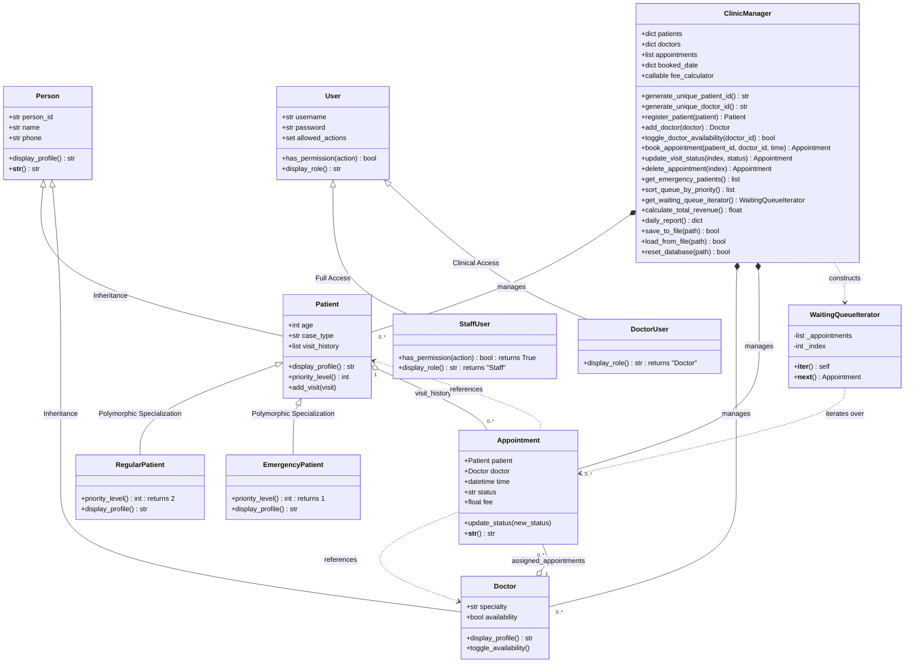

# Smart Clinic Queue System - ERD & Class Diagram

## 1. Entity Relationship Diagram (ERD)

```mermaid
erDiagram
    PERSON {
        string person_id PK "Format: 'patient-num' or 'doctor-num'"
        string name "Full Name (Mandatory)"
        string phone "11-digit Egyptian Mobile (01xxxxxxxxx)"
    }

    PATIENT {
        string person_id PK, FK "References PERSON.person_id"
        int age "Valid range: 1 - 130"
        string case_type "Diagnosis / Medical Case"
        string patient_type "Discriminator: 'Regular' | 'Emergency'"
        int priority_level "1 for Emergency | 2 for Regular"
    }

    REGULAR_PATIENT {
        string person_id PK, FK "References PATIENT.person_id"
        int priority_level "Fixed: 2 (Normal queue)"
    }

    EMERGENCY_PATIENT {
        string person_id PK, FK "References PATIENT.person_id"
        int priority_level "Fixed: 1 (Preempts queue)"
    }

    DOCTOR {
        string person_id PK, FK "References PERSON.person_id"
        string specialty "Medical Specialty"
        boolean availability "True = Available | False = Busy"
    }

    APPOINTMENT {
        int appointment_id PK "Surrogate Key / Unique Index"
        string patient_id FK "References PATIENT.person_id"
        string doctor_id FK "References DOCTOR.person_id"
        datetime appointment_time "Scheduled Date & Time (Future)"
        string status "pending | in_progress | completed | cancelled"
        float fee "Calculated via Triage Closure ($100 or $150)"
    }

    CLINIC_SCHEDULE {
        string doctor_id PK, FK "References DOCTOR.person_id"
        datetime booked_slot PK "Unique Active Slot (Double Booking Guard)"
    }

    %% Inheritance / Subtyping relationships (Class Table Inheritance)
    PERSON ||--o| PATIENT : "is extended by"
    PERSON ||--o| DOCTOR : "is extended by"
    PATIENT ||--o| REGULAR_PATIENT : "specializes into"
    PATIENT ||--o| EMERGENCY_PATIENT : "specializes into"

    %% Operational Relationships
    PATIENT ||--o{ APPOINTMENT : "books / attends (1:N)"
    DOCTOR ||--o{ APPOINTMENT : "is assigned to (1:N)"
    DOCTOR ||--o{ CLINIC_SCHEDULE : "maintains schedule (1:N)"
```

---

## 2. Object-Oriented Class Diagram

```mermaid
classDiagram
    class Person {
        +str person_id
        +str name
        +str phone
        +display_profile() str
        +__str__() str
    }

    class Patient {
        +int age
        +str case_type
        +list visit_history
        +display_profile() str
        +priority_level() int
        +add_visit(visit)
    }

    class RegularPatient {
        +priority_level() int : returns 2
        +display_profile() str
    }

    class EmergencyPatient {
        +priority_level() int : returns 1
        +display_profile() str
    }

    class Doctor {
        +str specialty
        +bool availability
        +display_profile() str
        +toggle_availability()
    }

    class Appointment {
        +Patient patient
        +Doctor doctor
        +datetime time
        +str status
        +float fee
        +update_status(new_status)
        +__str__() str
    }

    class WaitingQueueIterator {
        -list _appointments
        -int _index
        +__iter__() self
        +__next__() Appointment
    }

    class ClinicManager {
        +dict patients
        +dict doctors
        +list appointments
        +dict booked_date
        +callable fee_calculator
        +generate_unique_patient_id() str
        +generate_unique_doctor_id() str
        +register_patient(patient) Patient
        +add_doctor(doctor) Doctor
        +toggle_doctor_availability(doctor_id) bool
        +book_appointment(patient_id, doctor_id, time) Appointment
        +update_visit_status(index, status) Appointment
        +delete_appointment(index) Appointment
        +get_emergency_patients() list
        +sort_queue_by_priority() list
        +get_waiting_queue_iterator() WaitingQueueIterator
        +calculate_total_revenue() float
        +daily_report() dict
        +save_to_file(path) bool
        +load_from_file(path) bool
        +reset_database(path) bool
    }

    class User {
        +str username
        +str password
        +set allowed_actions
        +has_permission(action) bool
        +display_role() str
    }

    class StaffUser {
        +has_permission(action) bool : returns True
        +display_role() str : returns "Staff"
    }

    class DoctorUser {
        +display_role() str : returns "Doctor"
    }

    Person <|-- Patient : Inheritance
    Person <|-- Doctor : Inheritance
    Patient <|-- RegularPatient : Polymorphic Specialization
    Patient <|-- EmergencyPatient : Polymorphic Specialization

    User <|-- StaffUser : Full Access
    User <|-- DoctorUser : Clinical Access

    Patient "1" o-- "0..*" Appointment : visit_history
    Doctor "1" o-- "0..*" Appointment : assigned_appointments
    Appointment ..> Patient : references
    Appointment ..> Doctor : references
    WaitingQueueIterator ..> Appointment : iterates over

    ClinicManager *-- "0..*" Patient : manages
    ClinicManager *-- "0..*" Doctor : manages
    ClinicManager *-- "0..*" Appointment : manages
    ClinicManager ..> WaitingQueueIterator : constructs
```
