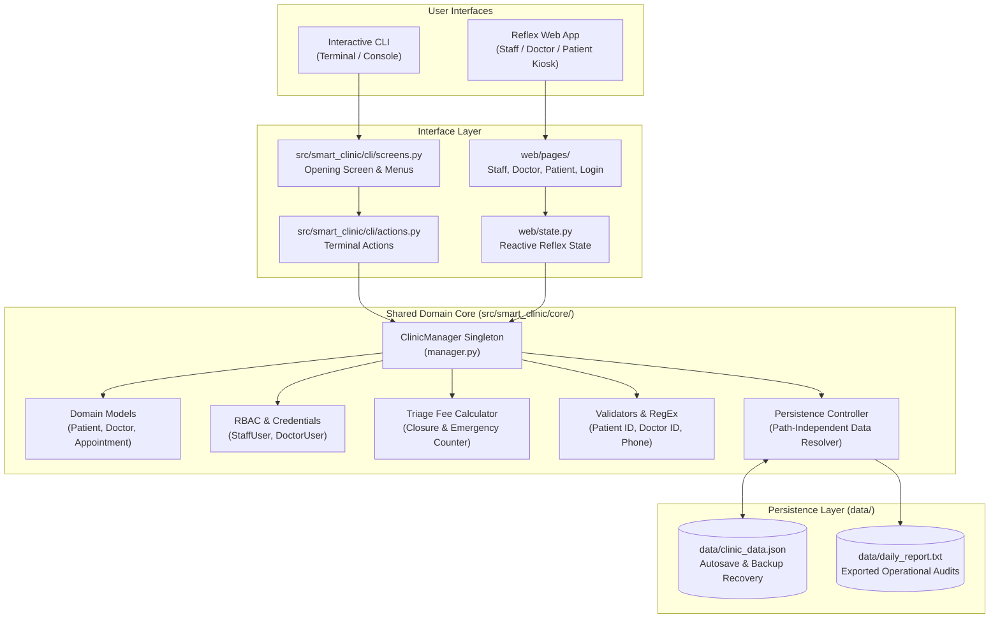

# Smart Clinic Management & Triage System

[](https://www.python.org/)
[](https://reflex.dev/)
[](#automated-testing)
[](#repository-structure)
[](LICENSE)

An enterprise-grade, multi-interface healthcare triage, appointment scheduling, and patient queue management system developed for the **Samsung Innovation Campus (SIC)** Capstone Project.

The system is built on a shared, robust domain layer featuring **dynamic triage fee calculation via closures**, **30-minute collision-proof slot scheduling**, **role-based access control (RBAC)**, **memoized recursive medical history lookups**, and **path-independent JSON persistence with auto-healing backups**. It offers two production interfaces sharing 100% of domain logic:
1. **Interactive CLI**: High-speed, terminal-based operational console with colored tables and keyboard workflows.
2. **Reflex Web App**: Modern, responsive healthcare SaaS web portal with separate views for Staff Administrators, Clinicians, and Patients.

---

## Table of Contents
- [System Architecture](#system-architecture)
- [Repository Structure](#repository-structure)
- [Key Features](#key-features)
- [Role-Based Access Control (RBAC)](#role-based-access-control-rbac)
- [30-Minute Collision Guard Matrix](#30-minute-collision-guard-matrix)
- [Quick Start & Installation](#quick-start--installation)
- [Usage Guide (CLI & Web)](#usage-guide-cli--web)
- [Automated Testing](#automated-testing)
- [Backward Compatibility](#backward-compatibility)

---

## System Architecture

Both the Terminal CLI and the Reflex Web Application share the exact same underlying domain models, business validation rules, and persistence controller:



---

## Repository Structure

```text
SIC-Smart-Clinic/
├── README.md                           # Comprehensive documentation & setup guide
├── requirements.txt                    # Project dependencies (Reflex, Pytest)
├── rxconfig.py                         # Reflex framework configuration
├── vercel.json                         # Vercel deployment configuration
├── .env.example                        # Cloud synchronization environment template
├── .gitignore                          # Clean Git ignore rules (caches, temp files)
├── main.py                             # Unified entrypoint (CLI default, --web flag)
│
├── src/                                # Core Python source package
│   └── smart_clinic/
│       ├── __init__.py                 # Top-level package exports
│       │
│       ├── core/                       # Shared Business & Domain Logic
│       │   ├── __init__.py             # Public domain API exports
│       │   ├── models.py               # Person, Patient, Doctor, Appointment, QueueIterator
│       │   ├── manager.py              # ClinicManager singleton domain orchestrator
│       │   ├── auth.py                 # User, StaffUser, DoctorUser, USERS_DB, authenticate()
│       │   ├── triage.py               # make_triage_calculator() closure, recursive search
│       │   ├── validators.py           # ID formats, Egyptian phone regex, status parsers
│       │   ├── exceptions.py           # Custom exception hierarchy
│       │   ├── persistence.py          # Path-independent get_data_path() and get_report_path()
│       │   └── cloud_sync.py           # CloudSyncClient (Vercel KV, JSONBin, REST, auto-recovery)
│       │
│       ├── cli/                        # Terminal Command-Line Interface
│       │   ├── __init__.py             # CLI package exports
│       │   ├── screens.py              # Opening screen, role navigation, login flow
│       │   └── actions.py              # 14 Staff actions, Doctor actions, Patient portal
│       │
│       └── web/                        # Web Application Components, State & Pages
│           ├── __init__.py             # Web package re-exports
│           ├── state.py                # Reactive Reflex state connected to ClinicManager
│           ├── styles.py               # Healthcare SaaS design tokens & theme palette
│           ├── components/             # Reusable UI cards, tables, headers, and badges
│           ├── dialogs/                # Modals (Patient, Doctor, Booking, History, Confirm)
│           └── pages/                  # Route views (Login, Staff, Doctor, Patient)
│
├── web/                                # Reflex Web Application Root
│   ├── __init__.py                     # Package init
│   └── web.py                          # Reflex App instance & route compilation
│
├── assets/                             # Static Images & Branding
│   ├── clinic_logo.png
│   ├── doctor_hero.png
│   ├── patient_hero.jpg
│   ├── logo.svg
│   └── styles.css
│
├── data/                               # Persistent Storage
│   └── clinic_data.json                # Canonical JSON database (Autosaved & Cloud-Synced)
│
├── tests/                              # Automated Pytest Test Suite
│   ├── __init__.py
│   ├── conftest.py                     # Shared fixtures (managers, sample entities)
│   ├── test_models.py                  # Domain models, priority levels, slot overlaps
│   ├── test_auth.py                    # RBAC permissions, credentials verification
│   ├── test_cloud_sync.py              # Cloud recovery, sync, and offline resilience
│   ├── test_manager.py                 # Booking, collisions, queue ordering, triage closure
│   ├── test_persistence.py             # JSON serialization, corrupt file recovery, reports
│   └── test_web.py                     # Reflex state and UI styles validation
│
└── docs/                               # Architecture Documentation
    ├── ERD.md                          # Entity-Relationship & Class Diagrams
    ├── CODE_EXPLANATION.md             # Detailed engineering implementation notes
    └── PROMPT_ROLE_REDESIGN.md         # RBAC architecture specification
```

---

## Key Features

### 1. Advanced Functional Programming & OOP
- **Triage Fee Closure**: `make_triage_calculator(base_fee)` encapsulates a private counter of treated emergency cases, dynamically calculating progressive emergency fees without global state.
- **Custom Iterator**: `WaitingQueueIterator` implements `__iter__` and `__next__` to traverse prioritized clinic queues safely.
- **Memoized Recursive History**: `find_visits_recursive()` traverses patient visit lists with memoized cache invalidation on new records.
- **Higher-Order Reductions**: Total clinic revenue computed using `functools.reduce` and filtered queues via `filter` + `lambda`.

### 2. 30-Minute Conflict Prevention Engine
Every appointment reserves a strictly enforced 30-minute busy duration:
- Overlap predicate: $\max(T_1, T_2) < \min(T_1 + 30	ext{m}, T_2 + 30	ext{m})$.
- Prevents double-booking doctors or overlapping patient schedules.
- Seamlessly handles adjacent slots (e.g., `10:00 - 10:30` followed immediately by `10:30 - 11:00`).
- Cancelling or deleting an appointment automatically releases the slot.

### 3. Path-Independent Resilience
- Automatic directory resolution (`get_data_path()`) locates `data/clinic_data.json` regardless of whether commands run from repo root, subfolders, or external scripts.
- **Auto-Healing Backups**: Corrupt or malformed database files trigger an automatic `.bak` backup copy and regenerate a clean schema without crashing.

### 4. Cloud Recovery & Synchronization Engine
- **Ephemeral Auto-Recovery**: On startup in serverless or cloud container deployments (Vercel, Render, Railway), the system automatically checks and recovers the clinic database from cloud storage.
- **Continuous Background Synchronization**: Every write action (patient registration, appointment booking, status change) automatically synchronizes with the cloud backend.
- **Multi-Cloud Backends**: Native support for Vercel KV / Upstash Redis, JSONBin.io, or generic REST webhooks via standard library `urllib` (zero external dependencies).
- **Offline-First Resilience**: Transparent fallback to local file persistence if the cloud is unreachable.

---

## Role-Based Access Control (RBAC)

| Role | Username / Access | Password | Operational Scope |
|---|---|---|---|
| **Staff Member** | `staff` | `staff123` | Complete administration: register patients/doctors, book appointments, manage queue, export financial reports, reset database. |
| **Doctor / Clinician** | `doctor` | `doc123` | Clinical operations: view prioritized waiting queue, update consultation status (in progress / completed), inspect patient visit history. |
| **Patient** | *Self-Service ID Lookup* | *No Password* | View personal appointment schedule, track live queue position, review completed visit history. |

---

## Quick Start & Installation

### Prerequisites
- Python 3.10+ (Python 3.11 recommended)
- Node.js 18+ (required only if running the Reflex Web App)

### 1. Clone the Repository
```bash
git clone https://github.com/mohamed-elhosary1/SIC-Smart-Clinic.git
cd SIC-Smart-Clinic
```

### 2. Set Up Virtual Environment
```bash
python -m venv venv
# On Windows:
venv\Scripts\activate
# On Linux/macOS:
source venv/bin/activate
```

### 3. Install Dependencies
```bash
pip install -r requirements.txt
```

---

## Usage Guide

### Running the Interactive CLI
Launch the terminal console directly:
```bash
python main.py
```
*Tip: You can also pass demo credentials or directly access the patient portal from the opening screen.*

### Running the Reflex Web Application
Launch the reactive web application in development mode:
```bash
python main.py --web
# OR directly via Reflex:
reflex run
```
Open your browser at `http://localhost:3000`.

---

## Automated Testing

The repository includes a comprehensive 21-test automated suite covering all layers:

```bash
pytest tests/ -v
```

### Test Coverage Highlights:
- `test_models.py`: Emergency vs Regular priority levels, 30-minute interval collisions, queue iterator.
- `test_auth.py`: Staff and Doctor permission matrices, authentication validation.
- `test_manager.py`: Registration duplicate guards, 30-minute busy slot collision checks, triage closure pricing, priority queue ordering.
- `test_persistence.py`: JSON save/load roundtrips, corrupt file backup and recovery, daily report text exports.
- `test_web.py`: Reflex reactive state attributes, design system tokens.

---

## Backward Compatibility

All legacy entrypoints and scripts remain 100% compatible:
- `python main.py` runs the interactive terminal application just as before.
- `from main import ClinicManager, Patient, Doctor` re-exports all domain entities from `smart_clinic.core` transparently.
- Historical milestone scripts and initial prototypes are preserved in `docs/archive/`.

---

## Contributors & Acknowledgements
- **Samsung Innovation Campus (SIC)** — Healthcare Software Engineering Capstone
- **Project 5 Team**: Smart Clinic Queue System
